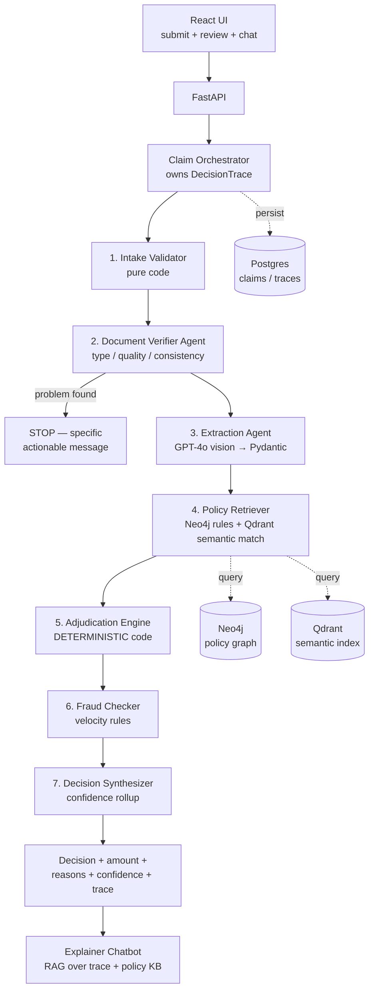

# Claims Processing System — Build Plan

> Working plan for the Plum AI Engineer assignment. This document drives the build and
> later seeds the graded `ARCHITECTURE.md`. Timeline: 2–3 days.

---

## 1. Goal

Automate health-insurance claim adjudication: member submits claim details + medical
documents → system validates documents, extracts structured data, applies policy rules
from `policy_terms.json`, and returns `APPROVED / PARTIAL / REJECTED / MANUAL_REVIEW`
with approved amount, reasons, confidence score, and a **complete decision trace**.

## 2. Evaluation-driven priorities

| Criteria | Weight | Our answer |
|---|---|---|
| System Design | 30% | Multi-agent pipeline, clean contracts, fallback on every external dependency, documented trade-offs + 10x scaling story |
| Engineering Quality | 25% | Pydantic contracts at every boundary, async FastAPI, tests for every component, typed errors |
| Observability | 20% | `DecisionTrace` as a first-class data structure — every agent appends typed steps; UI renders the timeline; chatbot answers *from* the trace |
| AI Integration | 15% | GPT-4o only where judgment is needed (classify / extract / confirm matches). Structured outputs validated by Pydantic. LLM **never** decides money |
| Document Verification | 10% | Fail-fast verifier with specific, actionable messages (type, quality, cross-doc consistency) |
| Bonus | — | Multi-agent architecture (orchestrator + 5 specialist agents) |

**Guiding principle: 75% of the grade is engineering. The LLM is a swappable,
failure-prone component inside a deterministic, observable pipeline.**

## 3. Tech stack

- **Backend:** Python 3.11+, FastAPI (async), Pydantic v2
- **Frontend:** React (Vite), decision-trace timeline UI, chat panel
- **LLM:** OpenAI GPT-4o (vision extraction, doc classification, semantic-match confirmation), `text-embedding-3-small` for embeddings
- **Stores (all free cloud tiers):**
  - **Postgres** (Neon / Supabase) — system of record: claims, documents, decisions, traces (JSONB), claims history
  - **Qdrant Cloud** — semantic policy index (exclusions, covered/excluded procedures, waiting-period conditions)
  - **Neo4j AuraDB** — policy-as-graph: Policy→Category→Rules/Limits/DocRequirements, Member→Dependents, Claim→Provider
- **Repo:** GitHub, conventional commits, one commit per meaningful step (clean history is graded)

## 4. Architecture



### Pipeline stages

1. **Intake Validator** (pure code) — payload sanity: member exists, policy active,
   amount ≥ minimum, submission within deadline. No LLM.
2. **Document Verifier Agent** — per document: classify type (GPT-4o vision for real
   uploads; declared type in test mode), readability/quality check, deterministic field
   checks (doctor registration number vs state formats in `sample_documents_guide.md`),
   then cross-document consistency (patient names must match each other and the
   member/dependents).
   **Fails fast** with a message naming what was uploaded, what is required, and what
   to do next (TC001–TC003).
3. **Extraction Agent** — GPT-4o structured output → typed Pydantic document schemas
   (prescription, bills, lab report...) with per-field confidence.
4. **Policy Retriever** — pulls category rules/limits/doc-requirements from Neo4j;
   maps free-text diagnoses and bill line items to policy concepts via Qdrant
   (embedding search → GPT confirms borderline matches). E.g. "Personalised Diet and
   Nutrition Program" → exclusion "Obesity and weight loss programs" (TC012).
5. **Adjudication Engine** — **deterministic Python, zero LLM**. Ordered rule
   evaluation (see §6). Produces per-line-item verdicts and financial breakdown.
6. **Fraud Checker** — velocity rules from `fraud_thresholds`: same-day count,
   monthly count, high-value threshold → routes to MANUAL_REVIEW with named signals (TC009).
   Also consumes document signals from extraction: `DOCUMENT_ALTERATION` when amounts
   show corrections/overwrites (per `sample_documents_guide.md`).
7. **Decision Synthesizer** — combines rule outcomes + all confidence signals into the
   final decision object.

### Dual-mode intake (critical mechanical detail)

`test_cases.json` supplies documents as structured JSON (`actual_type`, `content`,
`quality`) with no image files. The pipeline therefore accepts **either** raw files
(→ vision extraction) **or** pre-extracted content (→ injected downstream, extraction
skipped and trace notes it). The eval runner uses the second mode. Same pipeline,
same trace, one code path after extraction.

### Resilience = the three-store risk turned into a feature

Every external dependency is wrapped (timeout, retry, typed fallback):

| Dependency | Fallback | Confidence effect |
|---|---|---|
| Neo4j down | In-memory policy snapshot (loaded from `policy_terms.json` at startup) | −0.05, trace notes degraded source |
| Qdrant down | LLM-only semantic matching; if LLM also down, exact/fuzzy string match | −0.10 / −0.25 |
| GPT down (extraction) | If pre-extracted content exists → proceed; else stop with retry guidance | −0.15 / n/a |
| GPT down (doc classify) | Trust declared type, flag unverified | −0.10 |
| Postgres down | Process in-memory, return decision, warn persistence failed | −0.05 |

`simulate_component_failure: true` (TC011) triggers this same machinery (skips a
non-critical component) — no special-case hacks.

## 5. Knowledge base design

**Ingestion pipeline** (`kb/ingest.py`): reads `policy_terms.json` →
- **Neo4j:** `(Policy)-[:HAS_CATEGORY]->(Category)-[:HAS_RULE]->(Rule)`,
  `(Category)-[:REQUIRES_DOC]->(DocType)`, `(Category)-[:COVERS|EXCLUDES]->(Procedure)`,
  `(Member)-[:DEPENDENT_OF]->(Member)`, waiting periods, fraud thresholds as properties.
- **Qdrant:** one point per policy concept (exclusion clause, covered/excluded
  procedure, waiting-period condition, covered system) with payload
  `{concept_type, category, canonical_name, rule_ref}`.
- **Postgres:** member roster.

**Why this earns its keep:** "no hardcoded policy logic" — a new policy is an
ingestion run, not a code change. That is also the 10x-scale answer (thousands of
policies, per-tenant graphs). If timeline slips, **Neo4j is cut first** — the
in-memory snapshot fallback becomes the permanent source, documented as a trade-off.

## 6. Adjudication rule order (deterministic)

Checks run in this order; first **hard fail** sets the primary rejection reason, but
ALL checks still run and land in the trace (ops sees the complete picture):

1. **Eligibility** — member in roster, policy period active, relationship covered
2. **Submission rules** — ≤30 days from treatment, amount ≥ ₹500
3. **Waiting periods** — initial 30d from `join_date`; condition-specific via
   diagnosis mapping (diabetes 90d…). Rejection message MUST state the eligibility
   date (TC005: joined 2024-09-01 + 90d → eligible 2024-11-30)
4. **Exclusions** — diagnosis + each line item semantically matched against
   exclusion list (TC012: high confidence ≥0.90 expected)
5. **Pre-authorization** — MRI/CT > ₹10,000, PET, planned procedures (TC007).
   Checked **before** per-claim limit so TC007 reports `PRE_AUTH_MISSING`
6. **Line-item adjudication** — per item: covered/excluded for category →
   PARTIAL when mixed (TC006: root canal ✓ ₹8,000, teeth whitening ✗ ₹4,000)
7. **Per-claim limit** — runs on the **eligible amount** (after excluded line items
   are removed) against an **effective cap = max(per_claim_limit, category sub_limit)**.
   Eligible > cap → **hard REJECT** (`PER_CLAIM_EXCEEDED`), NOT a cap-to-limit partial.
   TC008: eligible ₹7,500 > consultation cap ₹5,000 → REJECT.
   TC006: eligible ₹8,000 ≤ dental cap max(5,000, 10,000) = ₹10,000 → PARTIAL stands.
8. **Financial computation — ORDER IS GRADED (TC010):**
   `eligible base → network discount (if network hospital) → co-pay → sub-limit cap → annual/floater balance`
   TC010: ₹4,500 → 20% discount → ₹3,600 → 10% co-pay → **₹3,240**
9. **Fraud velocity** — same-day > 2, monthly > 6, amount > ₹25,000 → MANUAL_REVIEW
   with named signals (TC009)

### Confidence model

Start at 1.0; multiply/subtract per signal: extraction field confidence, doc quality
warnings, semantic-match score gray zone, degraded components (§4 table).

- Fraud signal or amount > ₹25,000 → decision `MANUAL_REVIEW`
- Confidence < 0.50 → `MANUAL_REVIEW`
- 0.50–0.75 → keep rule-based decision + `manual_review_recommended: true` (TC011
  expects APPROVED with lowered confidence + review note — NOT a MANUAL_REVIEW decision)
- Clean run → ≥ 0.85 (TC004 expects > 0.85; TC012 rejection expects > 0.90)

## 7. Component contracts (deliverable #3 — drafted here, refined in code)

Every boundary is a Pydantic model. Sketch:

| Component | Input | Output | Errors |
|---|---|---|---|
| Intake Validator | `ClaimSubmission` | `ValidatedClaim` | `IntakeError{code, field, message}` |
| Document Verifier | `ValidatedClaim + [DocumentRef]` | `VerifiedDocuments` or `DocumentProblem{file_id, found_type, required_type, action_needed}` | `VerificationUnavailable` |
| Extraction Agent | `VerifiedDocument` | `ExtractedDocument{fields, per_field_confidence}` | `ExtractionFailed{file_id, cause}` |
| Policy Retriever | `category, diagnosis, line_items` | `ApplicableRules{limits, copay, exclusion_matches[score], doc_reqs, waiting_periods}` | `KBDegraded{fallback_used}` |
| Adjudication Engine | `ExtractedClaim + ApplicableRules + MemberContext` | `Adjudication{verdict/item, financial_breakdown, failed_checks, passed_checks}` | none (pure function — always returns) |
| Fraud Checker | `MemberContext + claims_history` | `FraudAssessment{signals[], score}` | `HistoryUnavailable` |
| Decision Synthesizer | all above | `ClaimDecision{decision, approved_amount, reasons[], confidence, trace}` | none (always returns) |
| Explainer Chatbot | `claim_id, question` | `GroundedAnswer{answer, sources[]}` | `NoContext` |

### DecisionTrace (the 20%)

```
TraceStep {
  seq, component, started_at, duration_ms,
  action,            # what was checked/done
  input_summary,     # what it looked at
  outcome,           # PASS / FAIL / SKIPPED / DEGRADED
  detail,            # human-readable, specific
  confidence_delta,  # +/- and why
  rule_ref           # pointer into policy (e.g. waiting_periods.diabetes)
}
```

Persisted as JSONB with the decision; rendered as a timeline in the UI; the explainer
chatbot's retrieval corpus. **Test of done-ness: ops can reconstruct any decision
from the trace alone.**

## 8. API surface

- `POST /claims` — submit (JSON + optional file uploads) → `claim_id`
- `GET /claims/{id}` — decision + status
- `GET /claims/{id}/trace` — full trace
- `POST /claims/{id}/chat` — explainer chatbot (grounded in trace + policy KB)
- `POST /eval/run` — run all 12 test cases → structured results (feeds EVAL_REPORT.md)
- `GET /health` — component/dependency status

## 9. Explainer chatbot (spotlight feature — built LAST)

- Answers "why this decision?", "what do I resubmit?", "is X covered?"
- Retrieval: this claim's trace (Postgres) + policy concepts (Qdrant) → GPT-4o with
  answer-only-from-context system prompt; refuses when ungrounded
- Read-only. Never adjudicates. Half-day timebox; cut after Neo4j if squeezed
- Demo moment: waiting-period rejection → ask "when can I resubmit?" → bot answers
  "from 30 Nov 2024" straight from the trace

## 10. Repo structure

```
plum/
├── backend/
│   ├── app/
│   │   ├── main.py
│   │   ├── api/                 # routers
│   │   ├── orchestrator/        # pipeline + trace builder
│   │   ├── agents/              # verifier, extractor, explainer
│   │   ├── engine/              # adjudicator, financial, waiting, exclusions, fraud
│   │   ├── kb/                  # ingest, neo4j, qdrant, snapshot fallback
│   │   ├── models/              # Pydantic contracts (= deliverable #3)
│   │   └── core/                # config, resilience wrappers, errors
│   └── tests/                   # unit + pipeline tests (graded!)
├── frontend/                    # React: submit, decision + trace timeline, chat
├── data/                        # policy_terms.json, test_cases.json
├── eval/                        # runner → docs/EVAL_REPORT.md
└── docs/                        # ARCHITECTURE.md, CONTRACTS.md, ASSUMPTIONS.md, EVAL_REPORT.md
```

## 11. Build phases

| Phase | Scope | Exit criteria |
|---|---|---|
| **1. Skeleton + contracts** (D1 AM) | git init, scaffold, all Pydantic contracts, policy snapshot loader | contracts reviewed, repo pushed |
| **2. Deterministic core** (D1) | adjudication engine + fraud + financial math + trace builder, unit-tested against TC004–TC012 structured inputs | 9 decision cases produce expected outputs with NO LLM |
| **3. Doc verification + intake** (D1 PM) | verifier agent (test-mode), dual-mode intake, eval runner v1 | TC001–TC003 produce required messages; 12/12 eval green in test mode |
| **4. API + persistence + LLM** (D2 AM) | FastAPI endpoints, Postgres, GPT extraction + classification with structured outputs, resilience wrappers, mock document generator (fpdf2/PIL per `sample_documents_guide.md`, incl. blur variant for demo) | real file upload works end-to-end |
| **5. Knowledge base** (D2 PM) | Qdrant + Neo4j ingestion & queries, fallbacks, TC011 degradation path | eval still 12/12 with KB live AND with KB down |
| **6. UI** (D2 PM–D3 AM) | React submit form, decision view w/ trace timeline | demo-able end-to-end |
| **7. Chatbot** (D3 AM) | explainer endpoint + chat panel | grounded answers on demo claims |
| **8. Deliverables** (D3 PM) | ARCHITECTURE.md, CONTRACTS.md, EVAL_REPORT.md, test polish, README, demo video, deploy | submission ready |

**Cut line if slipping (in order): deploy → chatbot → Neo4j (snapshot becomes permanent, documented).**

## 12. Assumptions & open questions (grows during build)

1. **Sub-limit scope:** TC010 approves ₹3,240 on a CONSULTATION claim though the
   consultation `sub_limit` is ₹2,000 — so sub-limit applies to the **consultation-fee
   line item**, not the whole bill (TC004 consistent: fee ₹1,000 ≤ 2,000). Documented assumption.
2. **Rejection reasons:** all violated rules go in the trace; the primary
   `rejection_reasons` follows the §6 check order (TC007 → PRE_AUTH_MISSING even
   though ₹15,000 also exceeds per-claim limit).
3. **Test mode:** `actual_type` / `content` / `quality` fields in test cases are
   trusted as ground truth, bypassing vision extraction (documents come pre-extracted).
4. **`ytd_claims_amount` / `claims_history`** provided in the payload are trusted
   over DB state when present (test determinism).
5. **Per-claim limit scope:** a naive "claimed > ₹5,000 → reject" breaks TC006
   (dental ₹12,000 → expected PARTIAL ₹8,000, itself > ₹5,000). Reconciliation that
   fits all 12 cases: the check runs **after** line-item adjudication, on the
   **eligible amount**, against **max(per_claim_limit, category sub_limit)**.
   Earlier checks (pre-auth, exclusions) still win the primary rejection reason
   (TC007, TC012).
6. **Diagnosis shorthand:** extraction/mapping normalizes Indian medical shorthand
   (HTN → Hypertension, T2DM → Type 2 Diabetes, per `sample_documents_guide.md`)
   before waiting-period/exclusion matching — deterministic dictionary first,
   semantic match second.

## 13. Risks

| Risk | Mitigation |
|---|---|
| 3 cloud stores on a 2–3 day clock | Fallbacks from day 1; Neo4j on the cut line; engine works from snapshot alone (Phase 2 proves it) |
| LLM output drift breaking eval | Structured outputs + Pydantic validation + retry-with-error-feedback; deterministic engine unaffected |
| OneDrive path issues with tooling | Consider moving repo to a local path (e.g. `C:\dev\plum`) before heavy build |
| Demo video crunch | Script it from the three required beats early (doc-stop, full approval trace, decision retro) |
```
