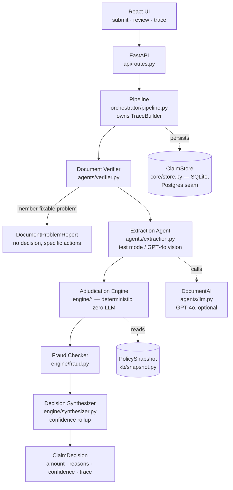

# Architecture

Automated adjudication of OPD health-insurance claims: a member submits claim
details plus medical documents; the system verifies the documents, extracts
structured data, applies the policy rules from `policy_terms.json`, and returns
`APPROVED / PARTIAL / REJECTED / MANUAL_REVIEW` with the approved amount,
specific reasons, a confidence score, and a **complete decision trace**.

## Design principles

1. **The LLM never decides money.** GPT-4o is used for exactly two judgment
   calls — "what kind of document is this?" and "what does it say?" — both
   behind typed contracts with validation. Every rupee of the decision comes
   from deterministic, unit-tested Python interpreting policy data.
2. **The trace is a first-class output, not a log.** Every component appends
   typed `TraceStep`s (component, action, outcome, detail, confidence delta,
   rule reference). The test of done-ness: operations can reconstruct any
   decision from the trace alone.
3. **Two failure regimes, never confused.** Problems the *member* can fix
   (wrong document, unreadable photo, mismatched patients) stop the pipeline
   early with specific instructions and **no decision**. Problems in *our
   infrastructure* (LLM down, store down) degrade: the pipeline continues,
   the trace records what was skipped, confidence drops, and manual review is
   recommended. Nothing crashes either way.
4. **Policy is data, not code.** The engine interprets `policy_terms.json`
   through typed lookups. A new policy is a data change; no rule is hardcoded.

## Component map

### Pipeline stages

| # | Stage | Responsibility | On failure |
|---|-------|---------------|-----------|
| 1 | Intake | Payload validation (Pydantic at the API boundary) | 422/400, never enters pipeline |
| 2 | Document Verifier | Required types per category, readability, cross-document patient consistency, registration-number format | Member-fixable → early stop with `DocumentProblem`s; classifier outage → trust declared type, flag unverified |
| 3 | Extraction | Pre-extracted content (test mode) or GPT-4o vision with per-field confidence | LLM down + no content → 503 with retry guidance (the one undecidable failure) |
| 4 | Adjudication Engine | Ordered rule checks (below), line-item verdicts, financial breakdown | Pure function — cannot fail; unknown data → `SKIPPED` check |
| 5 | Fraud Checker | Velocity rules (same-day/monthly), high-value threshold | Skipped → decision still produced, confidence −0.20, review recommended (TC011) |
| 6 | Synthesizer | Decision + confidence rollup + human-readable reasons | Pure function — always returns |

### Adjudication rule order (deterministic, all checks always run)

1. Eligibility (member in roster, policy active)
2. Submission rules (30-day deadline, ₹500 minimum)
3. **Exclusions** — before waiting periods: an excluded condition is *never*
   covered, so it must win the primary rejection reason over a merely
   time-bound rule. (Discovered via TC012: "Morbid Obesity" matches both the
   `obesity_treatment` waiting period and the obesity exclusion.)
4. Waiting periods — initial 30d + condition-specific; the rejection message
   states the exact date the member becomes eligible
5. Pre-authorization — named high-value tests above the category threshold
6. Line-item adjudication — covered/excluded per item → PARTIAL when mixed
7. Per-claim limit — checked on the **eligible amount** (after excluded items)
   against `max(per_claim_limit, category sub_limit)` — see ASSUMPTIONS.md #5
8. Financial computation, **order graded**: eligible base → network discount →
   co-pay → sub-limit cap → annual limit

The first failing check sets the primary rejection reason; every other
violation still lands in the trace so ops sees the whole picture.

### Confidence model

Start at 0.98 (never claim certainty), subtract per signal: degraded component
−0.20, poor-quality document −0.10, low-confidence extracted fields −0.10,
un-itemized bill −0.05, unverifiable registration −0.05. Below 0.50 →
`MANUAL_REVIEW`; 0.50–0.75 → decision stands with `manual_review_recommended`;
any degraded component also forces the recommendation. Every delta appears in
the trace next to the step that caused it.

## Decisions considered and rejected

| Considered | Rejected because |
|---|---|
| **LLM-driven adjudication** (hand the policy + claim to GPT and ask for a decision) | Unauditable, non-reproducible, and wrong on arithmetic ordering (TC010-style money math). The 12 decision cases pass with the LLM completely disabled — that's the property we wanted. |
| **Making the KB stores mandatory** (Qdrant/Neo4j/Postgres as hard dependencies) | Every store is env-activated with a tested fallback instead: Postgres (Neon) ↔ SQLite behind one protocol; Qdrant semantic tier ↔ deterministic token matcher; Neo4j policy graph ↔ in-memory snapshot. The eval must stay reproducible on a reviewer's laptop with zero accounts — and a live dependency you can kill mid-demo *is* the resilience story. |
| **Letting the vector index decide exclusions** | Semantic hits are *candidates* only — computed in the pipeline, passed into the engine as data, and threshold-checked deterministically (`SEMANTIC_EXCLUSION_THRESHOLD`). The engine still does no I/O and the token tier always wins when it matches (keeps the eval deterministic). |
| **Separate eval harness repo/scripts** | The eval runner lives in the app (`app/eval/runner.py`) and doubles as an API endpoint (`POST /eval/run`), so the report can never drift from the shipped pipeline. |
| **Rejecting claims on fraud signals** | Signals route to `MANUAL_REVIEW` with named evidence instead — false-positive rejections are the most expensive mistake in claims UX. |

## Knowledge & persistence stores

Three stores, each independently env-activated, each with a documented and
*tested* fallback. `uv run python -m app.kb.ingest` (re)builds the knowledge
stores from `policy_terms.json` — a new policy is an ingestion run, not a
code change.

| Store | Activated by | Job | Fallback when absent/down |
|---|---|---|---|
| **Postgres (Neon)** — `core/store.py` | `DATABASE_URL` | System of record; traces as queryable JSONB | SQLite (absent); decision returned with `persistence: failed` (down) |
| **Qdrant** — `kb/semantic.py` | `OPENAI_API_KEY` (embeddings); `QDRANT_URL` for cloud, else embedded local index | Semantic tier: one vector per policy concept; claim texts are nearest-neighbor matched into *candidate* exclusion hits | Deterministic token matcher, −0.10 confidence, trace notes the tier drop |
| **Neo4j AuraDB** — `kb/graph.py` | `NEO4J_URI` + `NEO4J_PASSWORD` | Policy-as-graph (categories, rules, doc requirements, member/dependent edges) — the multi-policy scale story; runtime cross-checks graph vs snapshot in the trace | In-memory snapshot, −0.05 confidence, `DEGRADED` trace step |

The matching hierarchy for free text → policy concept: **token match
(deterministic, always on) → vector candidates above the similarity threshold
→ LLM judgment (extraction only)**. Every tier's result lands in the trace
with a score, and no tier but the deterministic one can fire without being
visible.

`SEMANTIC_EXCLUSION_THRESHOLD` is calibrated against live
`text-embedding-3-small` scores, not guessed: the paraphrase "stomach
reduction operation for weight" — which shares no distinctive token with any
clause — scores 0.57 against "Bariatric surgery" and 0.48 against "Obesity
and weight loss programs", while unrelated diagnoses fall well below. The
threshold sits at 0.55.

**Verified live** (`scripts/verify_kb.py`): Neon Postgres healthy with claim
+ trace round-trips, Neo4j Aura serving `CONSULTATION → [HOSPITAL_BILL,
PRESCRIPTION]` from the graph, Qdrant Cloud answering the paraphrase query
above from 48 indexed policy concepts. Neo4j writes/reads go through the
driver's **managed transactions**, which retry transient failures — Aura Free
drops idle connections routinely, and a dropped connection must not surface
as a failed claim.

The eval passes **12/12 in both modes**: deterministic (no credentials — the
committed `EVAL_REPORT.md`, reproducible on any machine) and
`--with-kb` (routed through all three live stores). That equivalence is the
point: the stores add reach, never authority.

## Known limitations, and the 10x plan

| Limitation today | At 10x load |
|---|---|
| Synchronous processing: the API decides in-request (fine at ~1s deterministic path) | Queue-backed async: `POST /claims` returns `202 + claim_id`, workers consume; UI already polls `GET /claims/{id}` |
| SQLite single-writer | Postgres (JSONB for traces — they're already JSON), read replicas for the review console |
| Token-overlap semantic matching | Embedding index (Qdrant) as tier 1, LLM confirmation for the gray zone, token matcher stays as the always-on fallback; per-policy concept index rebuilt on policy ingestion |
| One policy, in-memory snapshot | Policy registry keyed by `policy_id` with versioning (claims must adjudicate against the terms in force on the treatment date); snapshot cache per policy |
| Vision extraction is per-document, sequential | Batch/parallel extraction (`asyncio.gather` over documents), response caching keyed by file hash |
| No auth | Member-scoped tokens; ops console behind SSO; PII encryption at rest |
| Fraud checker sees only payload-supplied history | Claims history from the store (same member/provider velocity across submissions), plus `DOCUMENT_ALTERATION` signals from extraction |
| A claim names the member, not the patient: a dependent's claim is inferred from the names on its documents | Declared `patient_id` validated against `eligible_patients()`, unlocking per-person rules (dependent sub-limits, age-based cover) that per-member terms cannot express |

## Testing strategy

123 tests, four layers: **unit** (matching rules, financial ordering and
rounding, fraud boundaries, snapshot lookups), **pipeline** (all 12 assignment
cases end-to-end, asserting decisions, amounts, reason codes, message
specificity, trace completeness), **upload path** (what the eval cases cannot
reach, because they arrive pre-typed: damaged files, multi-page PDFs carrying
several documents, malformed model output), and **API** (HTTP contracts:
200-with-problems for member-fixable stops, 503-with-guidance for undecidable
infrastructure failure, persistence round-trips). `POST /eval/run` regenerates
the eval verdict on demand; `docs/EVAL_REPORT.md` is the committed snapshot.
