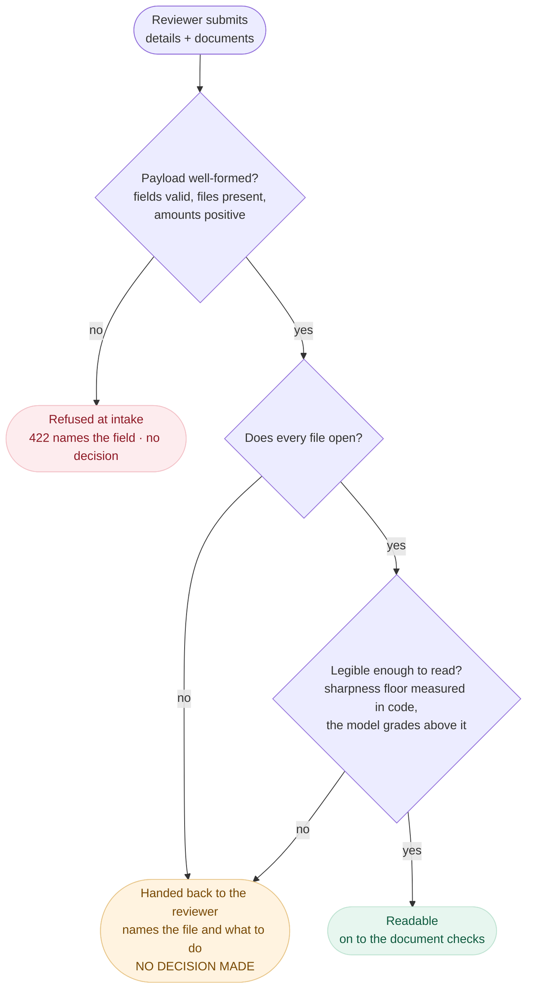
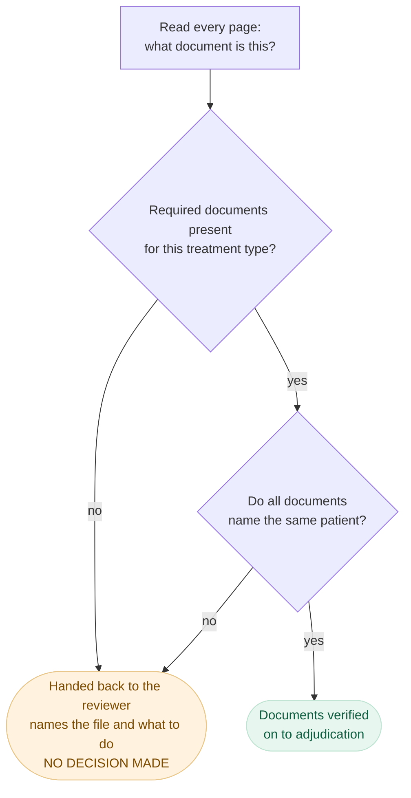
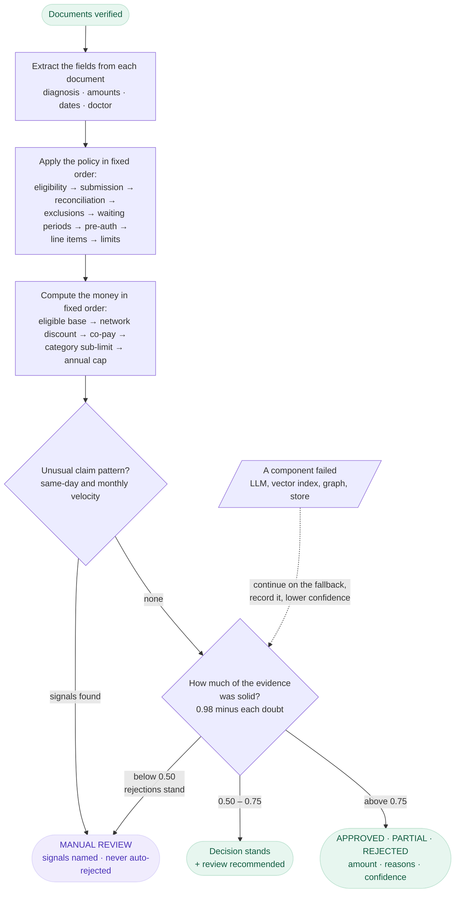

# Architecture

Automated adjudication of OPD health-insurance claims: a reviewer submits claim
details plus medical documents; the system verifies the documents, extracts
structured data, applies the policy rules from `policy_terms.json`, and returns
`APPROVED / PARTIAL / REJECTED / MANUAL_REVIEW` with the approved amount,
specific reasons, a confidence score, and a **complete decision trace**.

## Design principles

1. **The LLM never decides money.** GPT-4o is used for exactly two judgment
   calls — "what kind of document is this?" and "what does it say?" — both
   behind typed contracts with validation. Every rupee of the decision comes
   from deterministic, unit-tested Python interpreting policy data.
2. **The trace is a first-class output, not a log.** Every component appends
   typed `TraceStep`s (component, action, outcome, detail, confidence delta,
   rule reference). The test of done-ness: operations can reconstruct any
   decision from the trace alone.
3. **Two failure regimes, never confused.** Problems the *reviewer* can fix
   (wrong document, unreadable photo, mismatched patients) stop the pipeline
   early with specific instructions and **no decision**. Problems in *our
   infrastructure* (LLM down, store down) degrade: the pipeline continues,
   the trace records what was skipped, confidence drops, and manual review is
   recommended. Nothing crashes either way.
4. **Policy is data, not code.** The engine interprets `policy_terms.json`
   through typed lookups: every limit, list, percentage and threshold is a
   data change. What stays in code is behaviour — how a sub-limit binds,
   which exclusion list governs a category.

## How a claim is decided

### What happens to a claim

The shape that matters is where a claim can *stop*. Two of the four exits are
reached before the adjudication engine runs at all, and neither is a rejection.

#### First: can the claim be accepted, and can the files be read?

#### Then: are they the right documents, and are they all about one patient?

#### Reaching a decision

Two properties are worth reading off these. **A document problem is not a
rejection** — the claim is handed back with instructions and no decision is made,
which is a different outcome from REJECTED and is modelled as one. And **a
component failing is not an exit**: it feeds the confidence score, so processing
continues on a fallback and the shortfall shows up as a lower number with the
reason attached.

Every box appends to the claim's trace as it happens — component, action,
outcome, the numbers it looked at, the policy clause it applied, what it cost in
milliseconds, and how it moved confidence. The trace is the output, not a log.

### Where the code lives

| The step above | The component | Reads from |
|---|---|---|
| Intake | `api/routes.py` → Pydantic models | — |
| Open · legible · what is this | `agents/verifier.py`, `agents/imaging.py`, `agents/llm.py` | GPT-4o vision (optional) |
| Required documents · same patient | `agents/verifier.py` | `policy_terms.json` via `kb/snapshot.py`; Neo4j cross-checks it afterwards, advisory only |
| Extract the fields | `agents/extraction.py` (documents read concurrently) | GPT-4o vision, or content supplied by an eval case |
| Apply the policy · compute the money | `engine/checks.py`, `engine/financial.py` — **no LLM, no I/O** | `kb/snapshot.py`, Qdrant for paraphrase candidates |
| Claim pattern | `engine/fraud.py` | claim history supplied in the payload |
| Confidence and wording | `engine/synthesizer.py` | the accumulated penalties |
| Persist and serve | `core/store.py` | Postgres, or SQLite |

Two surfaces only read what the pipeline already decided, and neither can reach
the engine: the **assistant** (`agents/assistant.py` over `kb/retrieval.py`) and
**analytics** (`core/analytics.py`). That separation is the reason a chat answer
can never contradict a decision — it has no way to make one.

### Pipeline stages

| # | Stage | Responsibility | On failure |
|---|-------|---------------|-----------|
| 1 | Intake | Payload validation (Pydantic at the API boundary) | 422 naming the field, never enters pipeline |
| 2 | Document Verifier | Required types per category, readability, cross-document patient consistency, registration-number format | Reviewer-fixable → early stop with `DocumentProblem`s; classifier outage → trust declared type, flag unverified |
| 3 | Extraction | Pre-extracted content (test mode) or GPT-4o vision with per-field confidence | LLM down + no content → 503 with retry guidance (the one undecidable failure) |
| 4 | Adjudication Engine | Ordered rule checks (below), line-item verdicts, financial breakdown | Pure function — cannot fail; unknown data → `SKIPPED` check |
| 5 | Fraud Checker | Velocity rules (same-day/monthly), high-value threshold | Skipped → decision still produced, confidence −0.20, review recommended (TC011) |
| 6 | Synthesizer | Decision + confidence rollup + human-readable reasons | Pure function — always returns |

### Adjudication rule order (deterministic, all checks always run)

1. Eligibility (member in roster, policy active)
2. Submission rules (30-day deadline, ₹500 minimum)
3. Amount reconciliation — do the line items sum to the claimed amount
   (±₹0.01)? A mismatch can never be the primary rejection, but it costs
   −0.25 confidence — the largest single penalty in the system
4. **Exclusions** — before waiting periods: an excluded condition is *never*
   covered, so it must win the primary rejection reason over a merely
   time-bound rule. (Discovered via TC012: "Morbid Obesity" matches both the
   `obesity_treatment` waiting period and the obesity exclusion.)
5. Waiting periods — initial 30d + condition-specific; the rejection message
   states the exact date the member becomes eligible
6. Pre-authorization — named high-value tests above the category threshold
7. Line-item adjudication — covered/excluded per item → PARTIAL when any item
   fails; a claim whose every item is excluded is a ₹0 PARTIAL, not a REJECTED
8. Per-claim limit — checked on the **eligible amount** (after excluded items)
   against `max(per_claim_limit, category sub_limit)` — see ASSUMPTIONS.md #5
9. Financial computation, **order graded**: eligible base → network discount →
   co-pay → sub-limit cap → annual limit

The first failing check sets the primary rejection reason; every other
violation still lands in the trace so ops sees the whole picture.

### Confidence model

Start at 0.98 (never claim certainty), subtract per signal: line items that do
not reconcile with the claimed amount −0.25 (the largest penalty in the
system), degraded component −0.20, poor-quality document −0.10, low-confidence
extracted fields −0.10, semantic tier down −0.10, un-itemized bill −0.05,
unverifiable registration −0.05, graph unreachable or inconsistent −0.05.
Below 0.50 an APPROVED or PARTIAL decision becomes `MANUAL_REVIEW` — a
rejection already carries its reasons and stands; 0.50–0.75 → the decision
stands with `manual_review_recommended`; any degraded component also forces
the recommendation. Every delta appears in the trace next to the step that
caused it.

## Decisions considered and rejected

| Considered | Rejected because |
|---|---|
| **LLM-driven adjudication** (hand the policy + claim to GPT and ask for a decision) | Unauditable, non-reproducible, and wrong on arithmetic ordering (TC010-style money math). The 12 decision cases pass with the LLM completely disabled — that's the property we wanted. |
| **Making the KB stores mandatory** (Qdrant/Neo4j/Postgres as hard dependencies) | Every store is env-activated with a tested fallback instead: Postgres (Neon) ↔ SQLite behind one protocol; Qdrant semantic tier ↔ deterministic token matcher; Neo4j policy graph ↔ in-memory snapshot. The eval must stay reproducible on a reviewer's laptop with zero accounts — and a live dependency you can kill mid-demo *is* the resilience story. |
| **Letting the vector index decide exclusions** | Semantic hits are *candidates* only — computed in the pipeline, passed into the engine as data, and threshold-checked deterministically (`SEMANTIC_EXCLUSION_THRESHOLD`). The engine still does no I/O and the token tier always wins when it matches (keeps the eval deterministic). |
| **Separate eval harness repo/scripts** | The eval runner lives in the app (`app/eval/runner.py`) and doubles as an API endpoint (`POST /eval/run`), so the report can never drift from the shipped pipeline. |
| **Rejecting claims on fraud signals** | Signals route to `MANUAL_REVIEW` with named evidence instead — false-positive rejections are the most expensive mistake in claims UX. |

## Knowledge & persistence stores

Three stores, each independently env-activated, each with a documented and
*tested* fallback. `uv run python -m app.kb.ingest` (re)builds the knowledge
stores from `policy_terms.json` — a new policy is an ingestion run, not a
code change.

| Store | Activated by | Job | Fallback when absent/down |
|---|---|---|---|
| **Postgres (Neon)** — `core/store.py` | `DATABASE_URL` | System of record; traces as queryable JSONB | SQLite (absent); decision returned with `persistence: failed` (down) |
| **Qdrant** — `kb/semantic.py` | `OPENAI_API_KEY` (embeddings); `QDRANT_URL` for cloud, else embedded local index | Semantic tier: one vector per policy concept; claim texts are nearest-neighbor matched into *candidate* exclusion hits | Deterministic token matcher, −0.10 confidence, trace notes the tier drop |
| **Neo4j AuraDB** — `kb/graph.py` | `NEO4J_URI` + `NEO4J_PASSWORD` | Policy-as-graph (categories, rules, doc requirements, member/dependent edges) — the multi-policy scale story; runtime cross-checks graph vs snapshot in the trace | In-memory snapshot, −0.05 confidence, `DEGRADED` trace step |

The matching hierarchy for free text → policy concept: **token match
(deterministic, always on) → vector candidates above the similarity threshold
→ LLM judgment (extraction only)**. Every tier's result lands in the trace
with a score, and no tier but the deterministic one can fire without being
visible.

`SEMANTIC_EXCLUSION_THRESHOLD` is calibrated against live
`text-embedding-3-small` scores, not guessed: the paraphrase "stomach
reduction operation for weight" — which shares no distinctive token with any
clause — scores 0.57 against "Bariatric surgery" (recorded beside the
constant it calibrates), while unrelated diagnoses fall well below. The
threshold sits at 0.55.

**Verified live**: `scripts/verify_kb.py` health-checks all three cloud
stores — Neo4j Aura serving `CONSULTATION → [HOSPITAL_BILL, PRESCRIPTION]`
from the graph, Qdrant Cloud answering the paraphrase query above from 48
indexed policy concepts — and the credential-gated tests cover what a health
check cannot: claim + trace round-trips through Neon Postgres
(`tests/test_store.py`) and the required-documents assertion against the live
graph (`tests/test_kb.py`). Neo4j writes/reads go through the driver's
**managed transactions**, which retry transient failures — Aura Free drops
idle connections routinely, and a dropped connection must not surface as a
failed claim.

The eval passes **12/12 in both committed runs** — structured and real
uploads (`EVAL_REPORT.md`, reproducible on any machine) — and `--with-kb`
re-runs the same cases through all three live stores to the same verdict,
printed rather than committed. That equivalence is the point: the stores add
reach, never authority.

## Known limitations, and the 10x plan

| Limitation today | At 10x load |
|---|---|
| Synchronous processing: the API decides in-request (fine at ~1s deterministic path) | Queue-backed async: `POST /claims` returns `202 + claim_id`, workers consume; the UI already fetches by id (`GET /claims/{id}`) and streams progress, so polling is a drop-in |
| SQLite single-writer | Postgres (JSONB for traces — they're already JSON), read replicas for the review console |
| Token-overlap semantic matching | Embedding index (Qdrant) as tier 1, LLM confirmation for the gray zone, token matcher stays as the always-on fallback; per-policy concept index rebuilt on policy ingestion |
| One policy, in-memory snapshot | Policy registry keyed by `policy_id` with versioning (claims must adjudicate against the terms in force on the treatment date); snapshot cache per policy |
| Vision extraction is per-document, sequential | Batch/parallel extraction (`asyncio.gather` over documents), response caching keyed by file hash |
| No auth | Member-scoped tokens; ops console behind SSO; PII encryption at rest |
| Fraud checker sees only payload-supplied history | Claims history from the store (same member/provider velocity across submissions), plus `DOCUMENT_ALTERATION` signals from extraction |
| A claim names the member, not the patient: a dependent's claim is inferred from the names on its documents | Declared `patient_id` validated against `eligible_patients()`, unlocking per-person rules (dependent sub-limits, age-based cover) that per-member terms cannot express |

## Testing strategy

149 tests (three of them gated on live-store credentials), five layers: **unit** (matching rules, financial ordering and
rounding, fraud boundaries, snapshot lookups), **pipeline** (all 12 assignment
cases end-to-end, asserting decisions, amounts, reason codes, message
specificity, trace completeness), **upload path** (what the eval cases cannot
reach, because they arrive pre-typed: damaged files, multi-page PDFs carrying
several documents, malformed model output), **assistant** (scope isolation and
the grounding gates, with the model injected as a scripted stub — what is tested
is that an ungrounded answer cannot be passed off as a sourced one, not what a
model happens to say), and **API** (HTTP contracts: 200-with-problems for
reviewer-fixable stops, 503-with-guidance for undecidable infrastructure failure,
persistence round-trips). `POST /eval/run` regenerates the eval verdict on
demand; `docs/EVAL_REPORT.md` is the committed snapshot.

## The assistant, and why it cannot decide

`POST /assistant/chat` answers four kinds of question — why a claim was decided
as it was, what the policy says, what the portfolio looks like, and how this
system itself works — over five sources, each used for what it is good at and
each with a fallback: the snapshot for exact lookups, Qdrant for paraphrase
recall (token matcher when embeddings are absent), Neo4j for traversals
(snapshot when unreachable), Postgres for claims and portfolio, and these
documents for questions about the system's own behaviour.

**Retrieval quality is measured, not assumed.** `app/eval/retrieval.py` holds a
24-case golden set — every question phrased the way someone would actually ask,
never in the clause's own words — and reports recall: **0.905 @1, 1.0 @3**. Three
cases are deliberate negatives (physiotherapy, dialysis, the wifi password),
because nearest-neighbour search always returns *something*, and the assistant's
grounding gate checks that a citation was retrieved, not that it was relevant.
The negatives are what set the floor: the worst correct top hit scores 0.416, the
best hit for a question the policy does not cover scores 0.380, so
`SEARCH_MIN_SCORE = 0.40` sits in the gap and every negative now returns nothing
at all. The margin is thin and the set is small, so the number is only as good as
the next run of the eval.

That last source exists because of a failure worth recording: asked what
architecture the application used, the assistant answered fluently from the
model's general knowledge, cited nothing, and was reported as grounded. How the
system behaves is written down, so it is now retrieved and cited by section
(`docs/architecture#design-principles`) like any other source.

It is a retrieval surface, not a second adjudicator, and that is enforced rather
than requested. Answering is a tool call, so replies are always structured. Three
gates then run: every citation must be a reference retrieved *in that turn*; an
answer must cite something when retrieval returned anything citable — the check
that the architecture question defeated; and every rupee figure must have come
from a tool or from the user's own question. A
gate failure returns the retrieved material with `grounded: false` and the failed
check named. Asked "would a ₹9,000 dental claim be approved?", it explains what
governs the answer and declines to predict one — the pipeline is the only thing
that decides money, and an assistant that guessed alongside it would undermine
every number the trace justifies.
